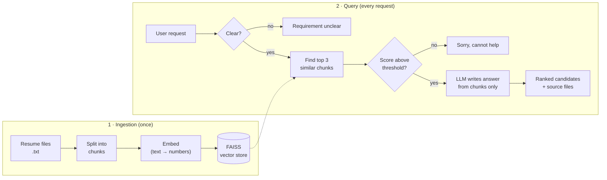

# Resume RAG Assistant

Describe the role you're hiring for in plain English, and the assistant finds the best-matching resumes from a resume library. It explains why each one matches and names the resume file it came from. If nothing fits, it says so instead of guessing.

```text
You:        "Need a React frontend developer with Redux experience"
Assistant:  ✅ Match found
            Priya Sharma — React UI Developer (Frontend Engineer)
            - React.js, Redux, Redux Toolkit, TypeScript, Next.js ...
            - Source: react_ui_developer.txt
```

---

## The idea

AI chatbots understand requests well, but they can **make things up**, such as a candidate or a skill that doesn't exist. In hiring that's unacceptable.

This project uses **Retrieval-Augmented Generation (RAG)**, which works like an *open-book exam* for AI:

1. **Retrieve:** search the resume library by *meaning*, not just keywords, so "frontend developer" also finds "React UI engineer".
2. **Generate:** give only the matching resume text to the AI, with strict instructions to answer **from that text alone** and to cite the source file.

Three **guardrails** keep it honest:

| Guardrail | Checks | If it fails |
|---|---|---|
| 1. Clear request | Is the request specific enough? (at least 3 words, not just "hi" or "help") | "Requirement unclear" plus a list of supported roles |
| 2. Confident match | Does the best resume score above a similarity threshold? | "Sorry, I cannot help with this query" |
| 3. Grounded prompt | The AI may use only the retrieved resume text and must refuse if nothing truly fits | No invented candidates, skills, or companies |

The library contains **8 fictional sample resumes**: Java/Spring Boot, React, Full Stack Python, Network Security (AWS), Application Security, DevOps (AWS), Data Engineer, and ML Engineer.

---

## Architecture

The system works in two phases. **Ingestion** prepares the resumes once. **Query** runs on every request.



---

## What each piece does

| File | Role |
|---|---|
| `data/resumes/` | The knowledge base: one resume per candidate as `.txt`, `.pdf` or `.docx`. `Name:` and `Title:` lines are read if present; otherwise the file name is used as the name. |
| `app/ingest.py` | **Ingestion.** Extracts the text from each resume (any of the three formats), reads the name and title, splits the text into ~800-character overlapping chunks, embeds them, and saves a FAISS index to `vectorstore/`. Also validates and saves uploaded resumes. |
| `app/rag_chain.py` | **The core.** Holds the guardrails, the retrieval step, the prompt that forces grounded answers, and `answer_query()`, the single function the UI and CLI call. |
| `app/config.py` | All settings in one place: model names, similarity thresholds, top-k, and the user-facing messages. Read from `.env`. |
| `app/demo_stubs.py` | **Offline demo mode.** Local stand-ins for OpenAI (TF-IDF embeddings and template answers), so everything runs with no API key or cost. |
| `app/streamlit_app.py` | Chat-style web interface with status badges, cited sources, one-click example requests, and a sidebar for **uploading resumes**. |
| `app/cli.py` | Command-line interface for one question or an interactive session. |
| `tests/` | 68 automated tests with 100% code coverage. Fully offline. |
| `eval/` | Quality evaluation: 18 labelled requests scored for "right resume found" and "right refusals". |
| `.github/workflows/tests.yml` | CI: runs the tests and the evaluation on every push and pull request. |

---

## Technology and why

| Technology | Used for | Why this choice |
|---|---|---|
| **Python** | Everything | The standard language for AI work, with the richest ecosystem of libraries |
| **LangChain** | Wiring the pipeline: loading, chunking, vector store, prompt, LLM call | Ready-made, swappable building blocks, so OpenAI can be replaced by another model or a test fake without rewriting the pipeline |
| **OpenAI `text-embedding-3-small`** | Turning text into embeddings (numbers that capture meaning) | Strong semantic search quality at very low cost |
| **OpenAI `gpt-4o-mini`** (temperature 0) | Writing the final recommendation | Fast and inexpensive. Temperature 0 keeps answers consistent and factual. |
| **FAISS** | Storing embeddings and finding the closest matches | Free, very fast, runs locally, with no database server to manage |
| **scikit-learn (TF-IDF)** | Offline demo-mode embeddings | Lets the app be demoed and tested without an API key |
| **pypdf** and **docx2txt** | Reading text from PDF and Word resumes | Small, pure-Python libraries with no system dependencies |
| **Streamlit** | Web UI | A full chat interface in pure Python, with no front-end code |
| **pytest + GitHub Actions** | Tests and CI | Catch regressions automatically on every change |

---

## Quick start

Requires **Python 3.10+**. Run all commands from the `resume-rag/` folder.

```bash
python3 -m venv venv && source venv/bin/activate     # Windows: venv\Scripts\activate
pip install -r requirements.txt
cp .env.example .env
```

In `.env`, choose a mode:

- **OpenAI mode:** `OPENAI_API_KEY=sk-...` and `DEMO_MODE=0`
- **Offline demo (free, no key):** `DEMO_MODE=1`

```bash
python -m app.ingest                     # build the index (re-run after changing resumes or DEMO_MODE)
streamlit run app/streamlit_app.py       # web app at http://localhost:8501
python -m app.cli "Need a React frontend developer with Redux experience"   # or use the command line
```

**Try these requests:**

| Request | Result |
|---|---|
| *Looking for an AWS network security engineer with firewall experience* | ✅ Match |
| *Application security engineer with OWASP and penetration testing skills* | ✅ Match |
| *help* | ❓ Requirement unclear |
| *I need a professional chef with 10 years of experience in Italian cuisine* | 🚫 No match |

**Adding resumes** (`.txt`, `.pdf` or `.docx`):

- **In the web app:** use **Add resumes** in the sidebar to choose one or more files, then click **Add to library**. Each file is checked, saved to `data/resumes/`, and searchable straight away.
- **By hand:** copy the files into `data/resumes/`, re-run `python -m app.ingest`, then restart the web app.

Files that can't be read are rejected with a message, and the existing library is left unchanged. For best results, start each resume with `Name:` and `Title:` lines. Added resumes stay out of git (see `.gitignore`); only the 8 fictional samples are tracked.

> 🔒 **The index is kept out of git too.** `vectorstore/` holds the full text of every indexed resume, so it's in `.gitignore`. It's generated: run `python -m app.ingest` after cloning, before starting the app.

Optional settings (`TOP_K`, `MIN_SIMILARITY_SCORE`, model names) are listed in `.env.example`.

---

## Testing

```bash
pip install -r requirements-dev.txt
pytest --cov=app --cov-branch          # 68 tests, 100% line and branch coverage
python -m eval.run_eval                # answer-quality metrics (needs the index from app.ingest)
```

- **Tests** check each guardrail, retrieval, ingestion, the OpenAI path (with a fake model, so no network call), PDF/Word reading, uploads (including bad and malicious files), the web app, and the CLI.
- **Evaluation** (demo mode) finds the right resume first in 11 of 11 role requests and gets the right outcome in 17 of 18 requests. The one miss: *"certified nurse for night shifts"* is wrongly matched because the word "certified" also appears in the tech resumes.
- **CI** fails the build if a test fails, coverage drops below 100%, or the evaluation scores fall below their thresholds.

---

## Limitations

- A proof of concept, **not** a production hiring system. It assists people and doesn't make decisions.
- Scanned (image-only) PDFs aren't supported because they contain no text to read. Older `.doc` files must be saved as `.docx` first.
- Each upload rebuilds the whole index. That's fine for a small library but slow for thousands of resumes.
- There's no login, so anyone who can open the app can upload resumes. There's also no connection to HR systems.
- In OpenAI mode, resume text is sent to OpenAI. Check your data-privacy policy before using real candidate data. Demo mode sends nothing externally.
