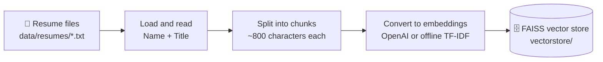
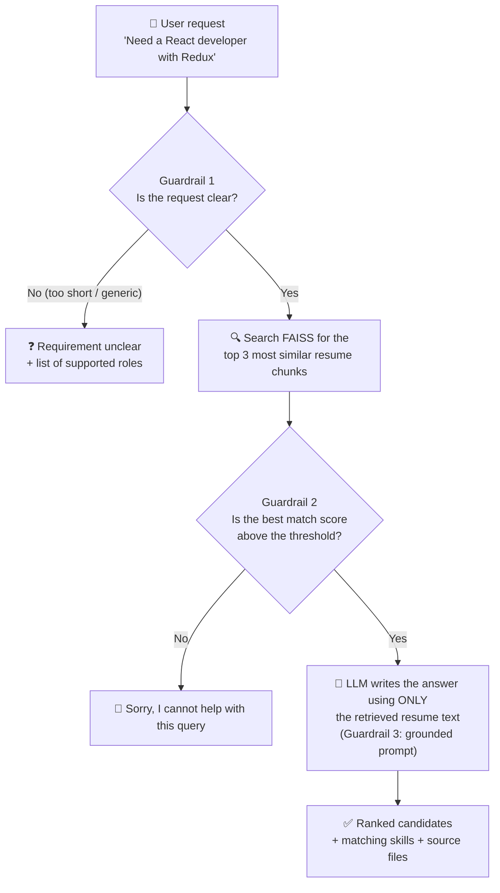

# Resume RAG Assistant

> **Describe the role you're hiring for in plain English, and get back the best-matching resumes from your own resume library. Every recommendation comes from what's actually written in those resumes. Nothing is made up.**

A working demo of **Retrieval-Augmented Generation (RAG)** and **prompt engineering**, built with **Python**, **LangChain**, **FAISS**, **OpenAI**, and **Streamlit**.

```text
You:        "Have requirement for Java Full stack developer, provide the matching resume"
Assistant:  ✅ Match found
            1. Arjun Mehta — Java Backend Developer (Spring Boot)
               - Matching skills: Java 17, Spring Boot, microservices, REST APIs ...
               - Source file: java_backend_springboot.txt
            2. ...
```

---

## Table of contents

1. [Who should read what](#1-who-should-read-what)
2. [Executive summary (leaders and business analysts)](#2-executive-summary-for-leaders-and-business-analysts)
3. [Guide for HR and recruiters](#3-guide-for-hr-and-recruiters)
4. [Key concepts in plain English](#4-key-concepts-in-plain-english)
5. [How it works](#5-how-it-works)
6. [The three guardrails (how it avoids making things up)](#6-the-three-guardrails-how-it-avoids-making-things-up)
7. [Sample resume library](#7-sample-resume-library)
8. [Technology stack](#8-technology-stack)
9. [Project structure](#9-project-structure)
10. [Getting started (installation and running)](#10-getting-started)
11. [Configuration reference](#11-configuration-reference)
12. [Example queries and expected results](#12-example-queries-and-expected-results)
13. [Technical deep dive (engineers)](#13-technical-deep-dive-for-engineers)
14. [Adding your own resumes](#14-adding-your-own-resumes)
15. [Troubleshooting](#15-troubleshooting)
16. [Security, privacy, and responsible use](#16-security-privacy-and-responsible-use)
17. [Limitations and future roadmap](#17-limitations-and-future-roadmap)
18. [FAQ](#18-faq)

---

## 1. Who should read what

You don't need to read the whole document. Start with the sections for your role:

| You are a...                         | Start with                                                                                  | Time needed |
|--------------------------------------|---------------------------------------------------------------------------------------------|-------------|
| **Leader / executive**               | [§2 Executive summary](#2-executive-summary-for-leaders-and-business-analysts), [§17 Limitations](#17-limitations-and-future-roadmap) | 5 min |
| **Business analyst**                 | §2, [§5 How it works](#5-how-it-works), [§6 Guardrails](#6-the-three-guardrails-how-it-avoids-making-things-up), §12 | 15 min |
| **HR / recruiter**                   | [§3 Guide for HR](#3-guide-for-hr-and-recruiters), [§12 Example queries](#12-example-queries-and-expected-results) | 10 min |
| **Beginner engineer / student**      | [§4 Key concepts](#4-key-concepts-in-plain-english), §5, [§10 Getting started](#10-getting-started) | 30 min |
| **Experienced engineer / architect** | §5, §6, [§13 Technical deep dive](#13-technical-deep-dive-for-engineers), §11, §17 | 20 min |

---

## 2. Executive summary (for leaders and business analysts)

### The problem

Recruiters and hiring managers spend a lot of time manually searching resume databases. Keyword search is brittle: a search for *"frontend developer"* can miss a resume that says *"React UI engineer"*. General-purpose AI chatbots understand language well, but they tend to **hallucinate**. They can confidently describe candidates, skills, or experience that don't exist, and that's unacceptable in hiring.

### The solution

The Resume RAG Assistant combines two ideas:

- **Semantic search.** It finds resumes by **meaning** instead of exact keywords.
- **Grounded AI answers.** An AI model writes the recommendation, but it's only allowed to use text taken from the matching resumes, and it has to name the source file for each claim.

When no resume fits the request, the assistant says **"Sorry, I cannot help with this query"** and doesn't guess.

### Business value

| Benefit                      | What it means in practice                                                                                  |
|------------------------------|------------------------------------------------------------------------------------------------------------|
| **Faster shortlisting**      | A plain-English requirement returns ranked candidates in seconds.                                          |
| **Trustworthy output**       | Answers are grounded in real resume text and cite source files. Refusing is preferred over inventing.      |
| **Natural language input**   | No boolean search strings or keyword lists needed.                                                          |
| **Auditable**                | Every recommendation lists the resume file(s) it came from, so a person can verify it.                     |
| **Low cost to run**          | Uses a small, inexpensive AI model (`gpt-4o-mini`) by default. An offline demo mode costs nothing.         |
| **Reusable pattern**         | The same RAG approach works for policies, contracts, support tickets, and other knowledge bases.           |

### What this project is and isn't

| ✅ It **is**                                                        | ❌ It **is not**                                                         |
|---------------------------------------------------------------------|--------------------------------------------------------------------------|
| A working proof of concept / learning project                       | A production Applicant Tracking System (ATS)                             |
| A demonstration of RAG, guardrails, and prompt engineering          | A tool that makes hiring decisions. It **assists** people.               |
| Runnable on a laptop, with or without an OpenAI API key             | Connected to live HR systems, job boards, or candidate databases         |
| Built on 8 **fictional** sample resumes                             | Trained on, or storing, real candidate data                               |

---

## 3. Guide for HR and recruiters

You don't need to know any programming to use the assistant once an engineer has set it up (see [§10](#10-getting-started)).

### Using the web app

1. Open the app in your browser (usually `http://localhost:8501`).
2. The **left sidebar** lists the job profiles the resume library covers, plus some **example requests** you can click.
3. Type your requirement into the chat box at the bottom, for example:
   *"Need a React frontend developer with Redux experience"*
4. The assistant replies with a **status badge**, the matching candidates, and the **source files** it used.

### What the status badges mean

| Badge                           | Meaning                                                                         | What to do                                                                  |
|---------------------------------|---------------------------------------------------------------------------------|-----------------------------------------------------------------------------|
| ✅ **Match found**               | One or more resumes match your requirement.                                     | Review the candidates and open the source resumes to confirm.               |
| 🚫 **No match / out of scope**   | Nothing in the resume library fits the request.                                 | Rephrase in terms of a technology role, or accept that nobody matches.     |
| ❓ **Requirement unclear**       | The request was too short or vague (for example "help" or "hi").                | Describe the role, tech stack, or skills. The reply lists supported roles. |

### Tips for good results

- **Mention the role and key skills:** *"AWS DevOps engineer with Terraform and Kubernetes"* works better than *"cloud person"*.
- **Use at least 3 words.** Very short requests are treated as unclear on purpose.
- **Always verify.** The assistant helps with shortlisting and doesn't replace reading the resume or interviewing the candidate.
- **A "No match" answer is a real result.** It means the library has no suitable candidate, and the assistant won't stretch a weak match to fill the gap.

---

## 4. Key concepts in plain English

If you're new to AI engineering, these terms will help with the rest of this document.

| Term                                 | Plain-English explanation                                                                                                                                         | Analogy                                                        |
|--------------------------------------|-------------------------------------------------------------------------------------------------------------------------------------------------------------------|----------------------------------------------------------------|
| **LLM (Large Language Model)**       | An AI model (like OpenAI's GPT) that reads and writes human language.                                                                                            | A very well-read assistant who writes fluently                 |
| **Hallucination**                    | When an LLM states something false with confidence, such as inventing a candidate's skill.                                                                       | A confident guess presented as fact                            |
| **RAG (Retrieval-Augmented Generation)** | First **retrieve** relevant documents, then have the LLM **generate** an answer using only those documents.                                                  | An open-book exam instead of answering from memory             |
| **Embedding**                        | A list of numbers that represents the *meaning* of a piece of text. Texts with similar meanings get similar numbers.                                              | GPS coordinates for meaning: similar ideas sit close together  |
| **Vector store (FAISS)**             | A database built to store embeddings and quickly find the ones closest to a query.                                                                               | A library index organised by topic instead of title            |
| **Chunking**                         | Splitting long documents into smaller overlapping pieces so search can return just the relevant part.                                                           | Pages of a book instead of the whole book                      |
| **Similarity / relevance score**     | A number from 0 to 1 showing how closely a resume chunk matches the query. Higher means closer.                                                                  | A "how good is this match?" rating                             |
| **Prompt engineering**               | Writing precise instructions for the LLM, such as "only use the provided resumes and never invent details".                                                      | A detailed brief given to a contractor                         |
| **Guardrail**                        | A safety check that stops the system from giving a bad or made-up answer.                                                                                         | A bouncer who checks requests at the door                      |
| **TF-IDF**                           | A classic, non-AI way to turn text into numbers based on word frequency. Used here for the offline demo mode.                                                     | Counting which distinctive words appear in each document       |

---

## 5. How it works

The system has two phases: a **one-time setup** that indexes the resumes, and the **question answering** that runs for every request.

### Phase 1: Ingestion (run once, or whenever resumes change)



### Phase 2: Answering a query (every request)



### The same flow in words

1. **Load:** every `.txt` resume in `data/resumes/` is read. The candidate's **Name** and **Title** are taken from the header.
2. **Chunk:** each resume is split into roughly 800-character pieces that overlap slightly so context isn't cut mid-thought.
3. **Embed and store:** each chunk becomes an embedding and is saved in a local **FAISS** index.
4. **Ask:** a user types a hiring requirement in the web app or on the command line.
5. **Check clarity:** requests that are too vague are answered with a helpful "please be more specific" message.
6. **Retrieve:** the request is embedded and the **3 closest resume chunks** are found, each with a relevance score.
7. **Check confidence:** if even the best chunk scores below the threshold, the assistant declines politely.
8. **Generate:** the retrieved chunks and the request go to the LLM with strict instructions. It returns a formatted, cited recommendation.

---

## 6. The three guardrails (how it avoids making things up)

Trust matters more than coverage in hiring, so the assistant checks each request at three points:

| # | Guardrail                     | When it triggers                                                                                     | Response                                               | Where in code                         |
|---|-------------------------------|------------------------------------------------------------------------------------------------------|--------------------------------------------------------|---------------------------------------|
| 1 | **Unclear query**             | Fewer than `MIN_QUERY_WORDS` (3) words, or only generic words like "hi", "help", "resume", "test"    | Capability message listing the supported roles         | `is_query_too_vague()` in `app/rag_chain.py` |
| 2 | **Low retrieval confidence**  | The best-matching chunk's relevance score is below `MIN_SIMILARITY_SCORE` (0.35 with OpenAI; 0.12 in demo mode) | *"Sorry, I cannot help with this query..."*          | `answer_query()` in `app/rag_chain.py` |
| 3 | **Grounded prompt**           | Always applied when an answer is generated                                                           | The LLM may use only the retrieved text and must refuse if nothing truly matches | `SYSTEM_PROMPT` in `app/rag_chain.py` |

**Extra detail for demo mode:** queries that share **no words at all** with the resume library (for example *"what is the weather"*) produce an all-zero TF-IDF vector. The similarity maths is undefined for a zero vector and would otherwise report a misleading ~0.5 score. The code detects this case and rejects the query straight away.

**Double safety net with OpenAI:** a request can pass Guardrail 2 and the LLM can still decide, under rule 2 of its instructions, that nothing truly fits. When the LLM replies *"Sorry, I cannot help..."*, the app reports the status as **No match** and clears the source list.

---

## 7. Sample resume library

The project ships with **8 fictional sample resumes** in `data/resumes/`. Names, emails (`@example.com`), and phone numbers are made up.

| Candidate       | Role / Title                              | File                                  |
|-----------------|-------------------------------------------|---------------------------------------|
| Arjun Mehta     | Java Backend Developer (Spring Boot)      | `java_backend_springboot.txt`         |
| Priya Sharma    | React UI Developer (Frontend Engineer)    | `react_ui_developer.txt`              |
| Rohan Verma     | Full Stack Web Developer (Python)         | `fullstack_python_developer.txt`      |
| Karan Singh     | Network Security Engineer (AWS)           | `network_security_engineer_aws.txt`   |
| Ananya Iyer     | Application Security Engineer             | `application_security_engineer.txt`   |
| Vikram Rao      | DevOps / Cloud Engineer (AWS)             | `devops_cloud_engineer_aws.txt`       |
| Sneha Kulkarni  | Data Engineer                             | `data_engineer.txt`                   |
| Aditya Nair     | Machine Learning Engineer                 | `ml_engineer.txt`                     |

Each resume follows the same simple format: a header (`Name:`, `Title:`, `Location:`, `Email:`), then *Professional Summary*, *Technical Skills*, *Experience*, *Education*, and *Certifications*. See [§14](#14-adding-your-own-resumes) to add your own.

---

## 8. Technology stack

| Layer                  | Technology                                   | Why it was chosen                                                                            |
|------------------------|----------------------------------------------|----------------------------------------------------------------------------------------------|
| Language               | **Python 3.10+**                             | The standard language for AI/ML work, with a large ecosystem                                 |
| AI orchestration       | **LangChain** (`langchain`, `langchain-community`, `langchain-openai`, `langchain-text-splitters`) | Standard building blocks for loaders, splitters, vector stores, prompts, and LLM chains |
| Vector database        | **FAISS** (`faiss-cpu`)                      | Fast, free, runs locally, no server to manage                                                |
| Embeddings (default)   | **OpenAI `text-embedding-3-small`**          | Good quality semantic embeddings at low cost                                                 |
| LLM (default)          | **OpenAI `gpt-4o-mini`** at temperature `0`  | Inexpensive and fast. Temperature 0 gives consistent, low-creativity answers.                |
| Offline demo           | **scikit-learn** TF-IDF                      | Lets the whole pipeline run with no API key and no internet                                  |
| Web UI                 | **Streamlit**                                | Builds a chat interface in pure Python with no front-end code                                |
| Configuration          | **python-dotenv**                            | Keeps secrets and settings in a `.env` file instead of in the code                          |
| Tokenizer              | **tiktoken**                                 | Used by OpenAI integrations to count tokens                                                  |

---

## 9. Project structure

```text
resume-rag/
├── app/                          # All application code
│   ├── __init__.py
│   ├── config.py                 # Settings: model names, thresholds, file paths, user-facing messages
│   ├── ingest.py                 # Phase 1: load → chunk → embed → save FAISS index
│   ├── rag_chain.py              # Phase 2: guardrails → retrieval → prompt → LLM answer (core logic)
│   ├── demo_stubs.py             # Offline stand-ins (TF-IDF embeddings + template answers) for DEMO_MODE
│   ├── streamlit_app.py          # Chat-style web interface
│   └── cli.py                    # Command-line interface (single query or interactive mode)
├── data/
│   └── resumes/                  # The resume "knowledge base" (8 sample .txt files)
├── vectorstore/                  # GENERATED by ingest.py; do not edit by hand
│   ├── faiss_index/              #   index.faiss + index.pkl (vectors + chunk text/metadata)
│   └── demo_vectorizer.pkl       #   fitted TF-IDF model (only in DEMO_MODE)
├── requirements.txt              # Python dependencies
├── .env.example                  # Template for your .env settings file
├── .env                          # Your local settings and API key (git-ignored, never commit)
└── README.md                     # This file
```

**Where to look first:** start with `app/rag_chain.py`. It contains the prompt, the guardrails, and the main `answer_query()` function. Every file is heavily commented line by line, which suits beginners.

---

## 10. Getting started

### Prerequisites

| Requirement        | Details                                                                                              |
|--------------------|------------------------------------------------------------------------------------------------------|
| Python             | **3.10 or newer** (check with `python3 --version`)                                                   |
| pip                | Comes with Python                                                                                    |
| OpenAI API key     | **Optional.** Needed only for full AI mode. Get one at <https://platform.openai.com/api-keys>. Without one, use [Demo mode](#option-b-offline-demo-mode-no-api-key-no-cost). |
| OS                 | macOS, Linux, or Windows                                                                             |

### Step 1: Install

```bash
cd resume-rag

# Create and activate an isolated Python environment (recommended)
python3 -m venv venv
source venv/bin/activate          # macOS / Linux
# venv\Scripts\activate           # Windows (PowerShell / CMD)

# Install dependencies
pip install -r requirements.txt
```

### Step 2: Configure

```bash
cp .env.example .env              # Windows: copy .env.example .env
```

Open `.env` and choose **one** of the two modes:

#### Option A: Full AI mode (OpenAI)

```ini
OPENAI_API_KEY=sk-...your-real-key...
DEMO_MODE=0
```

#### Option B: Offline demo mode (no API key, no cost)

```ini
DEMO_MODE=1
```

Demo mode swaps in a local TF-IDF embedding model and a template-based answer writer (`app/demo_stubs.py`). Retrieval, guardrails, and grounded answers still run end to end, with **no external API calls**. The answers are assembled from resume excerpts rather than written by an LLM, so they read more mechanically.

### Step 3: Build the vector store

Run this from the `resume-rag/` folder:

```bash
python -m app.ingest
```

Expected output (demo mode shown):

```text
Loaded 8 resumes -> split into N chunks.
DEMO_MODE=1 -> fitting local TF-IDF DemoEmbeddings (no API key needed).
FAISS index saved to .../resume-rag/vectorstore/faiss_index
```

> ⚠️ **Re-run this step whenever you add or edit resumes, or switch `DEMO_MODE` between 0 and 1.** The index must be built with the same embedding model that answers queries.

### Step 4: Run the app

**Web interface (recommended):**

```bash
streamlit run app/streamlit_app.py
```

Then open <http://localhost:8501> in your browser.

**Command line, single question:**

```bash
python -m app.cli "Have requirement for Java Full stack developer provide the matching resume"
```

```text
Query: Have requirement for Java Full stack developer provide the matching resume
Status: matched
Sources: ['java_backend_springboot.txt', ...]

Answer:
...
```

**Command line, interactive mode** (type `quit` or `exit` to leave):

```bash
python -m app.cli
```

---

## 11. Configuration reference

All settings live in `.env` (or environment variables) and are read by `app/config.py`.

| Variable                     | Default                  | Description                                                                                                  |
|------------------------------|--------------------------|--------------------------------------------------------------------------------------------------------------|
| `OPENAI_API_KEY`             | *(empty)*                | Your OpenAI API key. Required when `DEMO_MODE=0`.                                                            |
| `DEMO_MODE`                  | `0`                      | `1` runs fully offline (TF-IDF + template answers). `0` uses OpenAI.                                         |
| `CHAT_MODEL_NAME`            | `gpt-4o-mini`            | OpenAI chat model that writes the answer.                                                                    |
| `EMBEDDING_MODEL_NAME`       | `text-embedding-3-small` | OpenAI embedding model. **Re-run ingest if you change it.**                                                  |
| `LLM_TEMPERATURE`            | `0`                      | Randomness of the LLM. `0` gives the most consistent, factual answers.                                       |
| `TOP_K`                      | `3`                      | How many resume chunks to retrieve per query.                                                                |
| `MIN_SIMILARITY_SCORE`       | `0.35`                   | Confidence threshold (0–1) with OpenAI embeddings. Raise it to be stricter, lower it to be more lenient.     |
| `DEMO_MIN_SIMILARITY_SCORE`  | `0.12`                   | Confidence threshold in demo mode. TF-IDF scores fall in a lower range, so the threshold is lower.           |
| `MIN_QUERY_WORDS`            | `3`                      | Minimum words for a query to count as clear.                                                                 |

The user-facing **capability message** and **rejection message** are defined as constants in `app/config.py`, and you can edit them there.

**Tuning tip:** if good queries get rejected, lower the threshold a little. If unrelated queries still return matches, raise it. Change it in small steps (±0.05) and re-test with the queries in §12.

---

## 12. Example queries and expected results

| Query                                                                               | Expected status       | Why                                                                     |
|-------------------------------------------------------------------------------------|-----------------------|-------------------------------------------------------------------------|
| *Have requirement for Java Full stack developer provide the matching resume*        | ✅ Matched             | Java / Spring Boot and full-stack resumes are in the library            |
| *Looking for an AWS network security engineer with firewall experience*            | ✅ Matched             | Matches Karan Singh (Network Security Engineer, AWS)                    |
| *Need a React frontend developer with Redux experience*                            | ✅ Matched             | Matches Priya Sharma (React UI Developer)                               |
| *Application security engineer with OWASP and penetration testing skills*          | ✅ Matched             | Matches Ananya Iyer (Application Security Engineer)                     |
| *help*                                                                              | ❓ Unclear             | Too short and generic (Guardrail 1)                                     |
| *I need a professional chef with 10 years of experience in Italian cuisine*         | 🚫 No match            | No culinary resumes, so the score is below threshold (Guardrail 2)     |
| *what is the weather*                                                               | 🚫 No match            | Unrelated to hiring. In demo mode it shares no vocabulary with the library. |

These four matched queries are also available as **one-click buttons** in the web app sidebar.

---

## 13. Technical deep dive (for engineers)

### 13.1 Public API

The core logic is one function, which both the CLI and the Streamlit UI call:

```python
from app.rag_chain import answer_query

result = answer_query("Need a DevOps engineer with Terraform and EKS")
# {
#   "answer":  str,                          # final markdown answer
#   "status":  "matched" | "no_match" | "unclear",
#   "sources": ["devops_cloud_engineer_aws.txt", ...]   # empty unless matched
# }
```

`answer_query(query, vectorstore=None)` accepts a preloaded FAISS store. The Streamlit app caches one with `@st.cache_resource` so the index isn't reloaded from disk on every interaction.

### 13.2 Ingestion (`app/ingest.py`)

- **Loading:** one LangChain `Document` per `.txt` file. Metadata contains `source` (filename), `candidate_name`, and `candidate_title`, parsed with the regex `^Name:` / `^Title:`. The name falls back to the filename stem.
- **Chunking:** `RecursiveCharacterTextSplitter(chunk_size=800, chunk_overlap=100, separators=["\n\n", "\n", ". ", " "])`. The splitter prefers paragraph, then line, then sentence, then word boundaries. Chunks inherit the parent's metadata, so every retrieved chunk can be attributed to a candidate.
- **Indexing:** `FAISS.from_documents(...)`, persisted with `save_local()` to `vectorstore/faiss_index/`.

### 13.3 Retrieval and scoring (`app/rag_chain.py`)

- `similarity_search_with_relevance_scores(query, k=TOP_K)` returns `(Document, score)` pairs, best first.
- **Guardrail 2** only looks at the **top-1 score** against the active threshold.
- **OpenAI mode** uses LangChain's default FAISS relevance function (L2 distance converted to a score).
- **Demo mode** uses a custom `relevance_score_fn = clamp(1 − d/2, 0, 1)`. TF-IDF vectors are L2-normalised, so the squared L2 distance *d* satisfies *cos_sim = 1 − d/2*. This gives a true cosine similarity where FAISS's default would produce out-of-range values. The same function must be passed at both ingest time and load time.
- **Zero-vector guard (demo mode only):** if `embed_query()` returns all zeros (no vocabulary overlap), the query is rejected before search. For a zero vector, *d = 1*, which gives a constant, misleading score of 0.5.

### 13.4 Prompt engineering

`RESUME_MATCH_PROMPT` is a `ChatPromptTemplate` with:

- **System message:** the persona ("professional technical recruiting assistant") plus five hard rules:
  1. Ground every claim in the CONTEXT and never invent names, skills, employers, or years.
  2. If nothing reasonably matches, reply **exactly** `"Sorry, I cannot help with this query."`
  3. For each match, give name, title, matching skills, and source file, formatted as a markdown bullet list.
  4. Be concise and don't repeat the whole resume.
  5. Never fabricate contact details, certifications, or companies.
- **Human message:** `CONTEXT` (retrieved chunks, each prefixed with `[Source: file.txt]` and separated by `---`) plus the `HIRING REQUIREMENT`.

The chain is built with LCEL: `RESUME_MATCH_PROMPT | ChatOpenAI(...)`. Rule 2's exact refusal string is **machine-checked** afterwards (`startswith("Sorry, I cannot help")`) so the status is set correctly.

### 13.5 Demo mode internals (`app/demo_stubs.py`)

- `DemoEmbeddings` subclasses LangChain's `Embeddings` interface (`embed_documents`, `embed_query`), so it's a true drop-in replacement for `OpenAIEmbeddings`.
- TF-IDF settings: unigrams and bigrams, `max_features=4096`, `sublinear_tf=True`. Stop words are sklearn's English list plus **resume boilerplate** ("experience", "skills", "developed", "team", ...), so scores reflect distinguishing technology terms like "spring", "kafka", or "kubernetes".
- The fitted vectorizer is pickled to `vectorstore/demo_vectorizer.pkl` so queries use exactly the same vocabulary and IDF weights as the index.
- `demo_answer()` produces the same answer shape as the LLM prompt (ranked, de-duplicated candidates with confidence score, a 320-character excerpt, and the source file) using only string formatting.

### 13.6 Design decisions and trade-offs

| Decision                                   | Rationale                                                               | Trade-off                                                             |
|--------------------------------------------|-------------------------------------------------------------------------|-----------------------------------------------------------------------|
| Refuse rather than guess                   | Wrong candidate recommendations are costly in hiring                    | Some borderline valid queries may be rejected, so tune thresholds     |
| Local FAISS instead of a hosted vector DB  | Zero infrastructure, fast, free                                         | Single-process and in-memory. Not built for millions of resumes or concurrent writes. |
| Chunking (800 / 100)                       | Focused excerpts, better precision                                      | A candidate's skills can span chunks. The top-k may include several chunks from one resume. |
| Temperature 0                              | Reproducible, factual output                                            | Less varied phrasing                                                  |
| Pluggable embeddings (OpenAI / TF-IDF)     | Can be demoed and tested without keys or cost                           | Separate thresholds per backend. Re-ingest is required when switching. |
| Lazy imports of `langchain_openai`         | Demo mode never needs the OpenAI client or a key                        | Import errors surface only at runtime                                 |

---

## 14. Adding your own resumes

1. Save each resume as a **plain-text `.txt` file** in `data/resumes/`.
2. Start the file with a header in this format so the name and title are detected:

   ```text
   Name: Jane Doe
   Title: Senior Golang Developer
   Location: ...
   Email: ...
   ```

3. Rebuild the index:

   ```bash
   python -m app.ingest
   ```

4. Restart the Streamlit app so it loads the new index (it caches the old one in memory).
5. *(Optional)* Add the new role to `CAPABILITY_MESSAGE` in `app/config.py` and `SUPPORTED_ROLES` in `app/streamlit_app.py` so users know the role is supported.

> PDF and Word resumes aren't supported yet. Convert them to `.txt` first (see [Roadmap](#17-limitations-and-future-roadmap)).

---

## 15. Troubleshooting

| Symptom                                                                 | Likely cause                                                        | Fix                                                                                       |
|-------------------------------------------------------------------------|---------------------------------------------------------------------|-------------------------------------------------------------------------------------------|
| `Vector store not found. Run python -m app.ingest first`                 | The index hasn't been built                                          | Run `python -m app.ingest` from the `resume-rag/` folder                                   |
| `ModuleNotFoundError: No module named 'app'`                            | Command run from the wrong folder                                    | `cd resume-rag` first, then use `python -m app.ingest` / `python -m app.cli`               |
| `ModuleNotFoundError` for `langchain`, `faiss`, etc.                    | Dependencies missing, or virtual environment not active             | `source venv/bin/activate` then `pip install -r requirements.txt`                          |
| `AuthenticationError` / 401 from OpenAI                                 | Missing or invalid `OPENAI_API_KEY`                                  | Check the key in `.env`, or set `DEMO_MODE=1`                                              |
| `FileNotFoundError: demo_vectorizer.pkl`, or dimension-mismatch errors  | Index built in one mode, app running in the other                   | Re-run `python -m app.ingest` with the same `DEMO_MODE` you'll run the app with            |
| Every query returns "Sorry, I cannot help"                              | Threshold too strict, or wrong index                                 | Re-ingest, then lower `MIN_SIMILARITY_SCORE` / `DEMO_MIN_SIMILARITY_SCORE` slightly        |
| Unrelated queries still return matches                                  | Threshold too lenient                                                | Raise the threshold in small steps                                                         |
| New resumes don't appear in the web app                                 | Streamlit is still using the cached old index                        | Stop (Ctrl+C) and restart `streamlit run app/streamlit_app.py`                             |
| `OPENAI_API_KEY` changes in `.env` are ignored                          | The variable is already set in your shell, which takes precedence   | `unset OPENAI_API_KEY` or update the shell variable                                        |

---

## 16. Security, privacy, and responsible use

- **Secrets:** `.env` is in `.gitignore`. **Never commit API keys.** Use `.env.example` as the shareable template.
- **Data sent to OpenAI:** in full AI mode, resume chunks and queries are sent to OpenAI's API for embedding and generation. Before using real candidate data, check that your organisation's data-protection policy (for example GDPR or local privacy laws) and OpenAI's data-usage terms allow it. **Demo mode sends nothing externally.**
- **Sample data:** all bundled resumes are fictional.
- **Pickle files:** the FAISS index loads with `allow_dangerous_deserialization=True`, and the demo vectorizer uses `pickle`. That's safe for files **this app generated**, but never load a `vectorstore/` folder from an untrusted source, because pickle files can execute code.
- **Human in the loop:** the assistant is a **shortlisting aid**. Final hiring decisions must be made by people and must follow fair-hiring and anti-discrimination practices. Semantic search can reflect biases present in resume wording, so review results critically.

---

## 17. Limitations and future roadmap

### Current limitations

- Only `.txt` resumes (no PDF/DOCX parsing).
- Small, fixed library of 8 sample resumes. FAISS is local and single-process.
- No login, user roles, or audit log.
- No filters for structured criteria such as years of experience, location, or availability.
- The match threshold is a single global number that has to be tuned by hand.
- No automated test suite or evaluation dataset yet.

### Possible next steps

| Area               | Enhancement                                                                                                   |
|--------------------|---------------------------------------------------------------------------------------------------------------|
| Input formats      | PDF / DOCX loaders (for example LangChain `PyPDFLoader`, `Docx2txtLoader`)                                    |
| Search quality     | Hybrid search (keyword + semantic), re-ranking, metadata filters (location, years of experience)             |
| Scale              | Managed vector DB (pgvector, Pinecone, Weaviate, OpenSearch) and incremental ingestion                        |
| Quality assurance  | Unit tests for guardrails, a RAG evaluation set (for example RAGAS), and regression tests on example queries |
| Enterprise         | Authentication, role-based access, audit logging, and ATS integration                                         |
| Model flexibility  | Support for other LLM providers or locally hosted models                                                      |
| UX                 | Side-by-side candidate comparison, downloadable shortlist, and a link to open the full resume                |

---

## 18. FAQ

**Does the AI "learn" from or remember my resumes?**
No. Nothing is trained. The resumes are indexed in a local FAISS file, and for each question the relevant pieces are passed to the LLM as context. Delete the `vectorstore/` folder and the index is gone.

**Why did it say "Sorry, I cannot help" when a related candidate exists?**
The best match scored below the confidence threshold, or the LLM judged the match too weak. The system is deliberately conservative. Rephrase with more specific skills, or lower the threshold (see §11).

**Can it rank 50 candidates?**
It returns the top `TOP_K` chunks (3 by default). Increase `TOP_K` for more, keeping in mind that longer context costs more with OpenAI.

**How much does it cost to run?**
Demo mode is free. In OpenAI mode, embedding 8 resumes costs a tiny fraction of a cent, and each query makes one small `gpt-4o-mini` call. Check OpenAI's current pricing for exact figures.

**What is the difference between demo mode and OpenAI mode?**
Both use the same pipeline and guardrails. Demo mode uses word-based TF-IDF matching and template answers. OpenAI mode uses meaning-based embeddings and an LLM, which handles synonyms better (for example "frontend" and "UI") and writes more natural answers.

**Is this production-ready?**
No. It's a learning project and proof of concept. See §16 and §17 for what a production version would need.

---

<sub>Built as a learning project to demonstrate Retrieval-Augmented Generation, guardrails, and prompt engineering with LangChain and Python.</sub>
